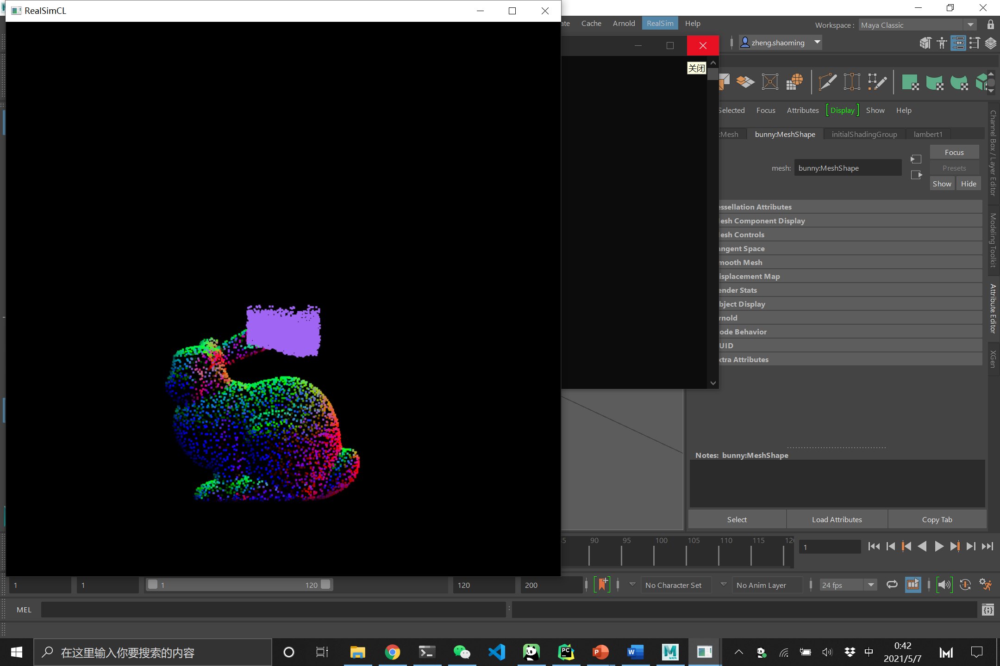
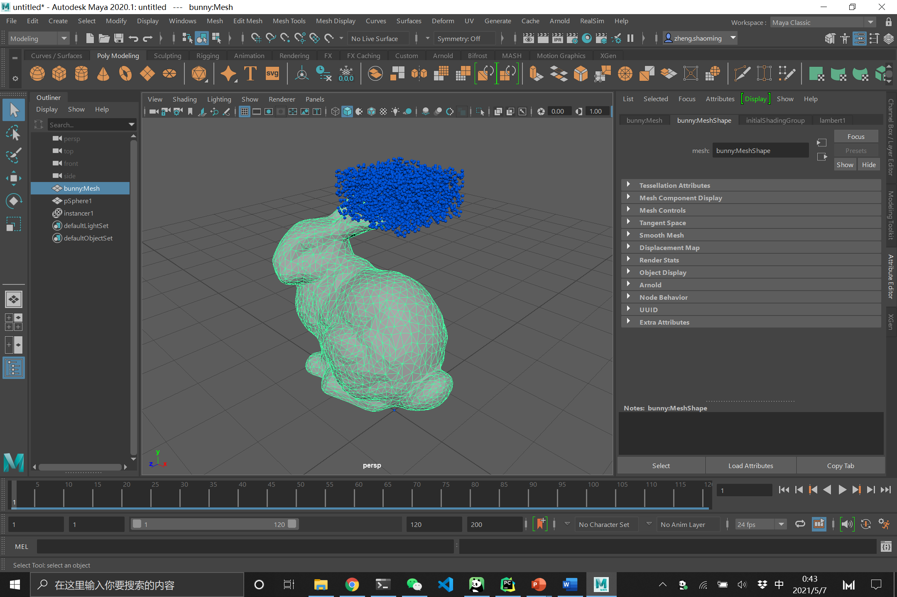
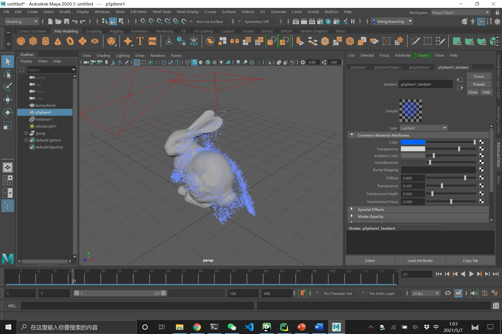

UPenn CIS-660 Authoring Tool by *Shaoming Zheng* and *Yihui Mao*.

# Demo

# Setup

## Environment

Use Visual Studio to setup your Maya installation location in `RealSimCL.sln` correctly.

Setup the directory of `RealSim` in `RealSimNode.py`

## Loading

Load the plugin by selecting `RealSimNode.py` in Maya.

## Models

Models should be placed under `mesh2pc`.
